# QuoteCraft 📱

*(Ein Projekt aus der Projektwoche 02.03.26 – 06.03.26)*

QuoteCraft ist eine elegante und minimalistische iOS-App, die Nutzern tägliche Inspiration durch Zitate bietet.
Die App zeigt zufällige Zitate von verschiedenen Autoren, ermöglicht das Speichern von Lieblingszitaten und bietet eine automatische Wiedergabe-Funktion.

Dieses Projekt wurde im Rahmen einer Projektwoche entwickelt, um die Arbeit mit **SwiftUI** und **SwiftData** zu demonstrieren und praktische Erfahrung in der Entwicklung moderner iOS-Anwendungen zu sammeln.

---

## 🚀 Features

### Grundlegende Funktionen

* **Zufällige Zitate:** Bei jedem Start der App wird ein neues, zufälliges Zitat angezeigt.
* **Favoriten-System:** Nutzer können Zitate als Favorit markieren und in einer separaten Liste speichern.
* **Swipe-to-Unfavorite:** Native iOS-Wischgeste, um Zitate schnell aus der Favoritenliste zu entfernen.
* **Eigene Zitate hinzufügen:** Nutzer können eigene Zitate mit Autor und Kategorie erstellen.

### Erweiterte Funktionen (Optionale Features)

* **Automatischer Zitatwechsel (Player):** Ein integrierter Timer (Play / Pause / Refresh) wechselt Zitate automatisch.
* **Kategorien & Filter:** Zitate sind in Kategorien wie *Motivation, Leben, Liebe, Erfolg* usw. unterteilt und können gefiltert werden.
* **Zitat als Bild teilen:** Eine Share-Funktion (ShareLink), um das aktuell angezeigte Zitat als ansprechendes Bild zu teilen.
* **Dark Mode Unterstützung:** Vollständige Anpassung an das System-Erscheinungsbild (Light/Dark Mode) mit dynamischen Farben.
* **Splash Screen & App Icon:** Ein benutzerdefinierter Ladebildschirm und ein App-Icon für ein poliertes Benutzererlebnis.

---

## 🛠 Technologien (Stack)

* **Sprache:** Swift
* **UI-Framework:** SwiftUI
* **Lokale Datenbank:** SwiftData (für das Speichern von Zitaten, Autoren und Favoriten)

---

## 📂 Projektstruktur

```text
QuoteCraft
│
├── Models
│
├── Views
│
├── Components
│
├── docs
│   ├── UML-Models.pdf
│   ├── Project-Documentation.pdf
│   └── screenshots
│
└── README.md
```

---

## ▶️ Projekt ausführen

1. Repository klonen

```
git clone <repository-url>
```

2. Projekt in **Xcode** öffnen

3. Auf einem iPhone Simulator oder Gerät starten

---

## 📄 Dokumentation

Weitere Dokumentation zum Projekt befindet sich im Ordner **docs**.

* UML Diagramm der Models
* Projektdokumentation

---

## 📱 Screenshots

### Splash Screen

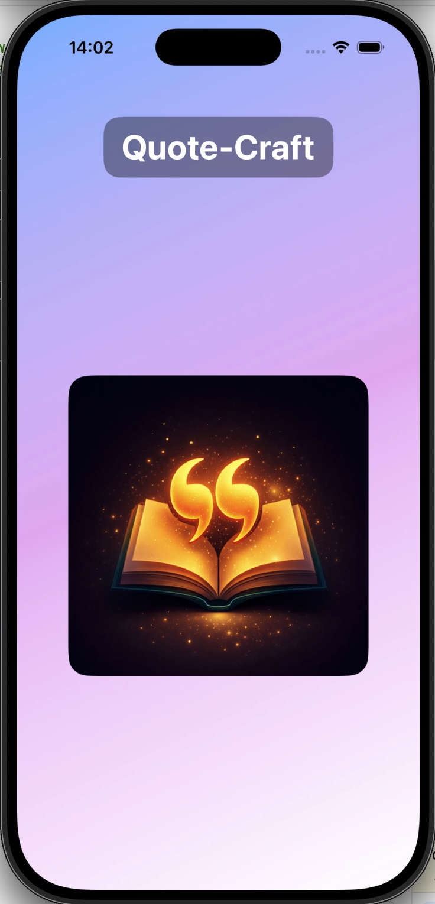

---

### Home View

| Light Mode                                 | Dark Mode                                                  |
| ------------------------------------------ | ---------------------------------------------------------- |
| 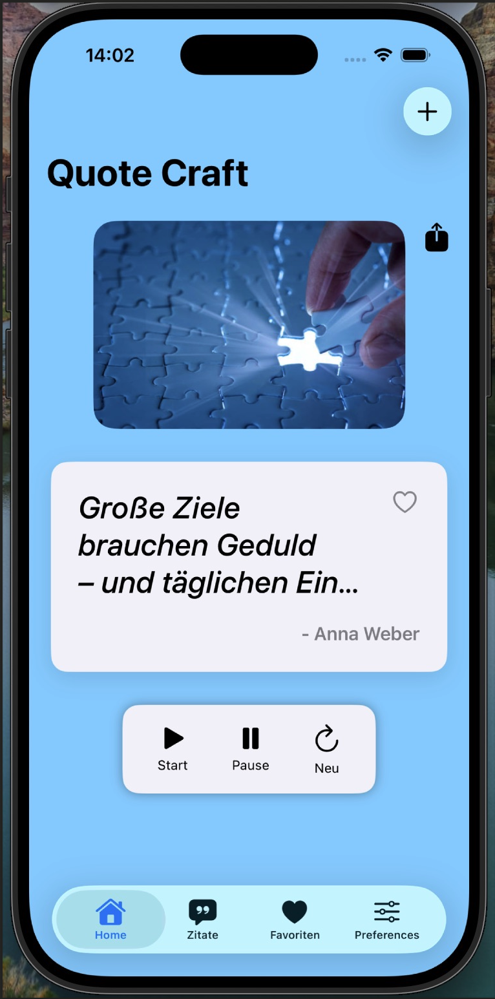 | 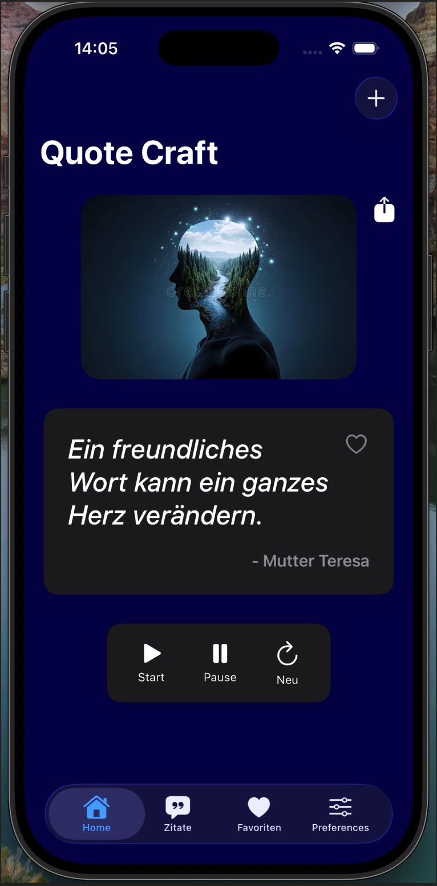 |

---

### Quote View

| Light Mode                                   | Dark Mode                                                    |
| -------------------------------------------- | ------------------------------------------------------------ |
| 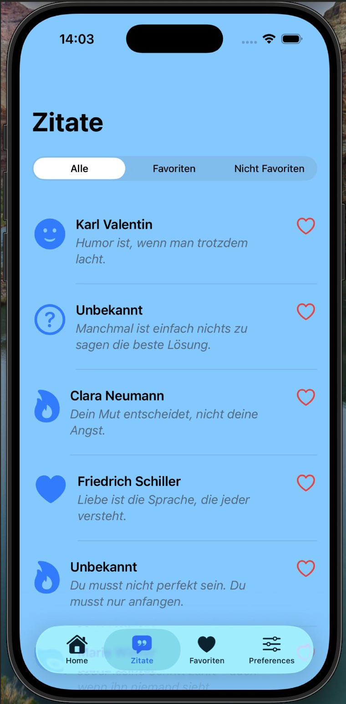 | 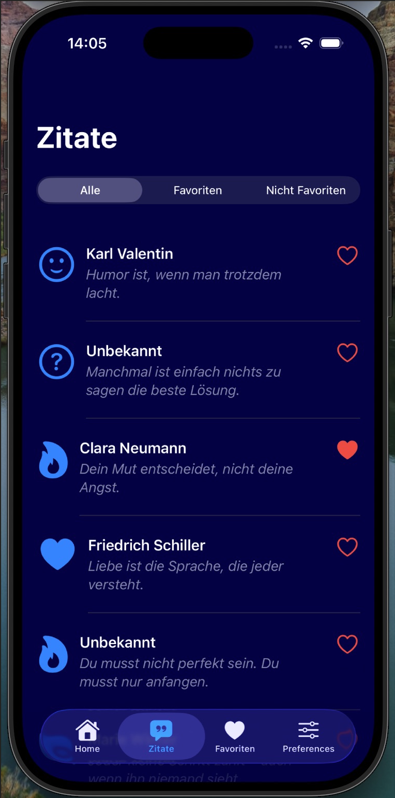 |

---

### Favorites

| Light Mode                                           | Dark Mode                                                    |
| ---------------------------------------------------- | ------------------------------------------------------------ |
| 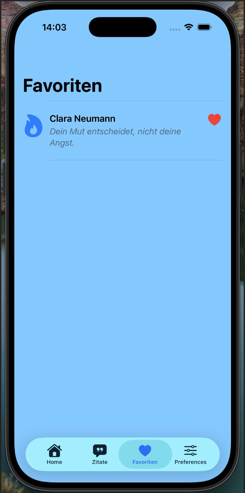 | 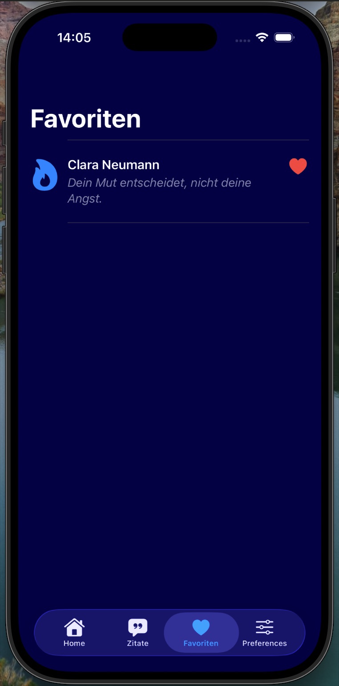 |

---

### Preferences

| Light Mode                                               | Dark Mode                                                                |
| -------------------------------------------------------- | ------------------------------------------------------------------------ |
| 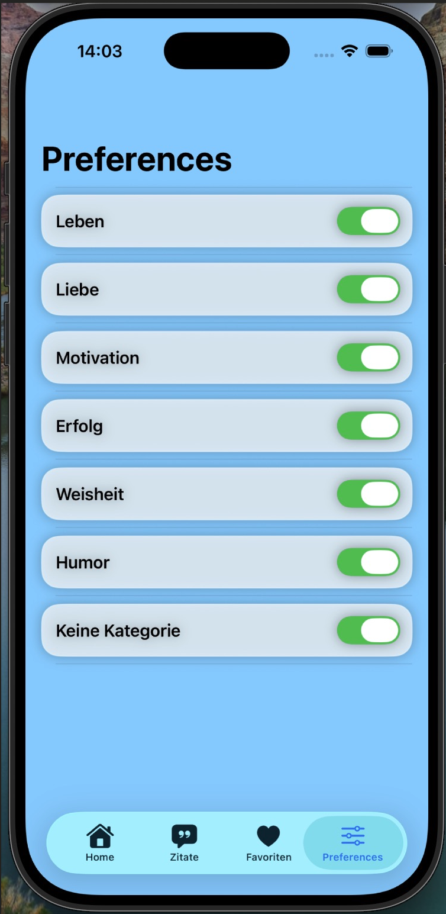 | 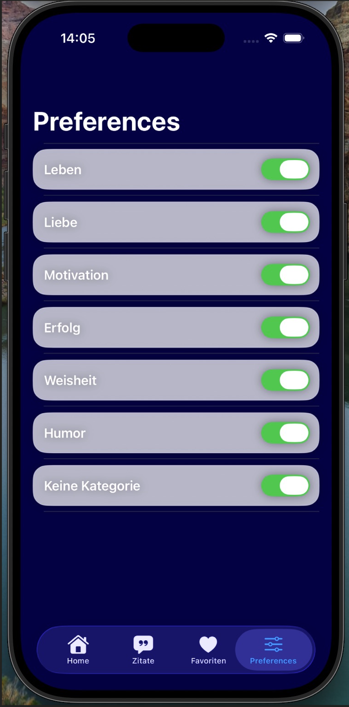 |

---

### Add Quote

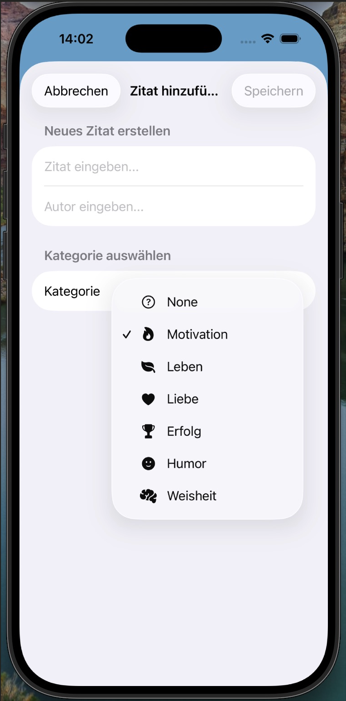

---

### Share Quote

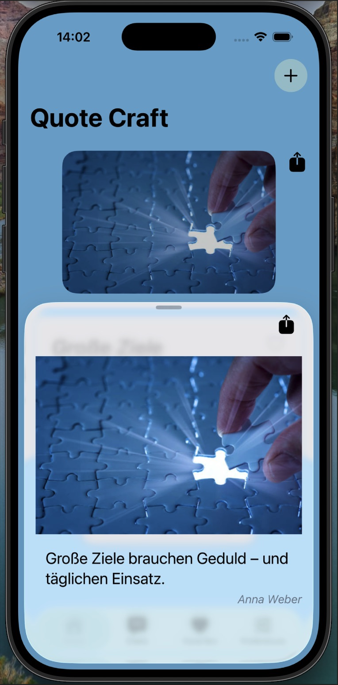

---

### Share Quote Function

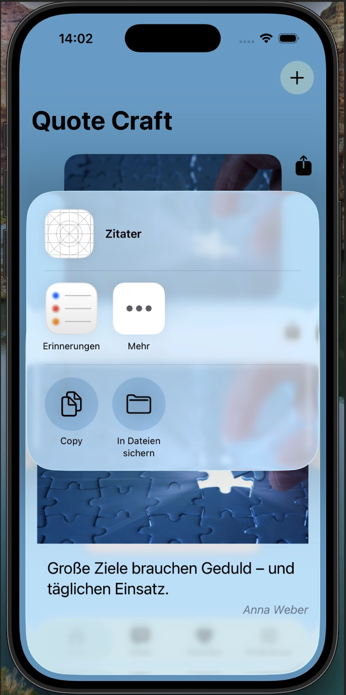

---

## 🎓 Kontext

Dieses Projekt wurde während einer **Projektwoche (02.03.26 – 06.03.26)** entwickelt.
Ziel war es, praktische Erfahrung mit **SwiftUI**, **SwiftData** und modernen iOS-Designrichtlinien zu sammeln.

